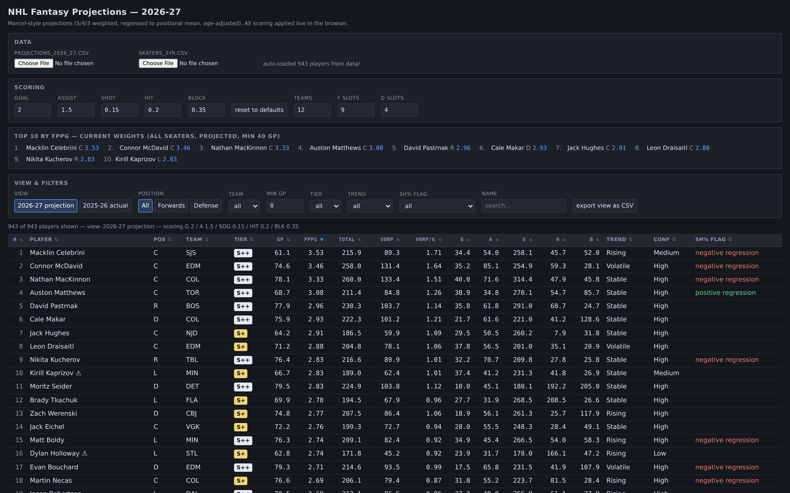
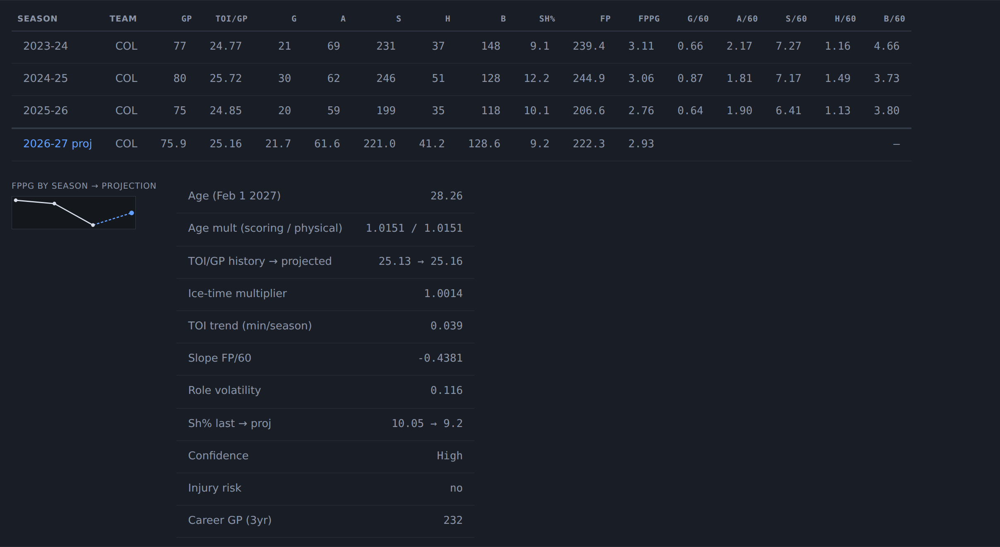

# NHL Fantasy Projection Tool — 2026-27

Three seasons of NHL skater data → a Marcel-style 2026-27 projection → a static
dashboard where you set the scoring and everything recomputes live.

No framework, no database, no build step. Python 3.11+ standard library only
(no pip install), plus one HTML file.

```
fetch_nhl.py       NHL API -> data/skaters_3yr.csv       (network, cached)
project.py         skaters_3yr.csv -> data/projections_2026_27.csv   (offline)
dashboard.html     both CSVs -> sortable, re-scoreable table
build_hosted.py    dashboard.html + CSVs -> dashboard_hosted.html (self-contained)
cache/             every raw API response, one file per request
```

<!-- RESULTS:START -->
<!-- Generated by make_readme.py -- edit that script, not this block. -->

## The projections

**[Open the interactive dashboard](https://ajfroster.github.io/2026-2027-NHL-fantasy-prep-tool/dashboard.html)** — sortable, filterable, and every
number recomputes live when you change the scoring weights. No install, no
server; it runs entirely in the browser off the CSVs in `data/`.

[](https://ajfroster.github.io/2026-2027-NHL-fantasy-prep-tool/dashboard.html)

Click any row to expand a player's three actual seasons beside the projection,
with per-60 rates, ice time, and the multipliers that produced the forecast:



### Top 25 for 2026-27

At the default scoring below, ranked by projected fantasy points per game.
943 skaters are projected in total (622 F, 321 D).

| # | Player | Pos | Team | Tier | GP | FPPG | Total | VORP | VORP/G |
|--:|---|:-:|:-:|:-:|--:|--:|--:|--:|--:|
| 1 | Macklin Celebrini | C | SJS | S++ | 61.1 | 3.53 | 215.9 | +89.3 | +1.71 |
| 2 | Connor McDavid | C | EDM | S++ | 74.6 | 3.46 | 258.0 | +131.4 | +1.64 |
| 3 | Nathan MacKinnon | C | COL | S++ | 78.1 | 3.33 | 260.0 | +133.4 | +1.51 |
| 4 | Auston Matthews | C | TOR | S++ | 68.7 | 3.08 | 211.4 | +84.8 | +1.26 |
| 5 | David Pastrnak | R | BOS | S++ | 77.9 | 2.96 | 230.3 | +103.7 | +1.14 |
| 6 | Cale Makar | D | COL | S++ | 75.9 | 2.93 | 222.2 | +101.2 | +1.22 |
| 7 | Jack Hughes | C | NJD | S+ | 64.2 | 2.91 | 186.5 | +59.9 | +1.09 |
| 8 | Leon Draisaitl | C | EDM | S+ | 71.2 | 2.87 | 204.8 | +78.2 | +1.05 |
| 9 | Kirill Kaprizov | L | MIN | S+ | 66.7 | 2.83 | 189.0 | +62.4 | +1.01 |
| 10 | Nikita Kucherov | R | TBL | S++ | 76.4 | 2.83 | 216.6 | +89.9 | +1.01 |
| 11 | Moritz Seider | D | DET | S++ | 79.5 | 2.83 | 224.9 | +103.8 | +1.11 |
| 12 | Brady Tkachuk | L | FLA | S+ | 69.9 | 2.78 | 194.5 | +67.9 | +0.96 |
| 13 | Zach Werenski | D | CBJ | S+ | 74.8 | 2.77 | 207.5 | +86.5 | +1.06 |
| 14 | Jack Eichel | C | VGK | S+ | 72.2 | 2.76 | 199.3 | +72.7 | +0.94 |
| 15 | Matt Boldy | L | MIN | S++ | 76.3 | 2.74 | 209.1 | +82.4 | +0.92 |
| 16 | Dylan Holloway | L | STL | S+ | 62.8 | 2.73 | 171.8 | +45.2 | +0.92 |
| 17 | Evan Bouchard | D | EDM | S++ | 79.3 | 2.71 | 214.6 | +93.5 | +0.99 |
| 18 | Martin Necas | C | COL | S+ | 76.6 | 2.69 | 206.1 | +79.5 | +0.87 |
| 19 | Jason Robertson | L | DAL | S++ | 79.5 | 2.68 | 213.1 | +86.5 | +0.86 |
| 20 | Quinn Hughes | D | MIN | S+ | 73.5 | 2.66 | 195.8 | +74.8 | +0.95 |
| 21 | Wyatt Johnston | C | DAL | S++ | 79.5 | 2.65 | 210.3 | +83.6 | +0.82 |
| 22 | Connor Bedard | C | CHI | S+ | 72.8 | 2.64 | 192.2 | +65.6 | +0.82 |
| 23 | Matthew Tkachuk | L | FLA | S+ | 55.7 | 2.62 | 145.9 | +19.2 | +0.80 |
| 24 | Rasmus Dahlin | D | BUF | S+ | 75.5 | 2.62 | 197.7 | +76.6 | +0.90 |
| 25 | Kyle Connor | L | WPG | S | 76.3 | 2.58 | 196.5 | +69.8 | +0.76 |

### Tiers

S++ is the top 12 players overall by projected season total — the first round of
a 12-team draft. S+ through D come from 1-D k-means on projected FPPG, computed
separately for each position group, so the breaks land on real gaps in the pool
rather than on round-number percentiles. Players projected under 40 games are
unranked.

| Tier | Forwards | F FPPG range | Defensemen | D FPPG range |
|:-:|--:|:-:|--:|:-:|
| **S++** | 9 | 2.65–3.53 | 3 | 2.71–2.93 |
| **S+** | 9 | 2.62–2.91 | 16 | 2.16–2.77 |
| **S** | 55 | 2.08–2.58 | 33 | 1.70–2.08 |
| **A** | 70 | 1.65–2.04 | 49 | 1.45–1.68 |
| **B** | 110 | 1.28–1.63 | 41 | 1.24–1.43 |
| **C** | 122 | 0.96–1.28 | 47 | 1.03–1.24 |
| **D** | 58 | 0.42–0.95 | 43 | 0.60–1.01 |

Replacement level in a 12-team league starting 9 F and 4 D:
**126.6 points (1.82 per game)**
for forwards, **121.1 points
(1.71 per game)** for defensemen. VORP and VORP/G are
measured against those, and both move when you change the league shape.

### Default scoring

| Goal | Assist | Shot on goal | Hit | Blocked shot |
|--:|--:|--:|--:|--:|
| 2.0 | 1.5 | 0.15 | 0.2 | 0.35 |

These are only the defaults. Weights are never baked into the projections —
`project.py` writes projected stat totals and the interfaces apply whatever
scoring you set, recomputing FPPG, totals, VORP, VORP/G and every tier on the
spot.

<!-- RESULTS:END -->

## Run

Verify the API is up before a full pull (one page, one season):

```bash
python3 fetch_nhl.py --dry-run
```

Full pull. First run makes ~30 stats requests plus one request per player
(~1,150) and takes a few minutes; every response is cached, so a second run is
near-instant and touches the network zero times.

```bash
python3 fetch_nhl.py
```

Force a re-fetch, ignoring the cache:

```bash
python3 fetch_nhl.py --refresh
```

Build the projections:

```bash
python3 project.py
```

League shape is configurable (affects replacement level / VORP only):

```bash
python3 project.py --teams 12 --f-slots 9 --d-slots 4
```

Open the dashboard. Double-clicking `dashboard.html` works — pick the two CSVs
with the file inputs at the top:

```bash
xdg-open dashboard.html
```

Or serve the directory and it auto-loads both files:

```bash
python3 -m http.server 8000
```

then visit `http://localhost:8000/dashboard.html`.

### Streamlit app (two tabs)

`app.py` is a Streamlit front end over the same two CSVs: one tab for the
2026-27 projection, one for the three-year history. It needs a virtual
environment, because Streamlit is not in the standard library:

```bash
uv venv --python 3.12 .venv && uv pip install --python .venv/bin/python streamlit
```

(`python3 -m venv .venv && .venv/bin/pip install streamlit` works too, if your
system has `python3-venv` installed.) Then:

```bash
.venv/bin/streamlit run app.py --server.address 127.0.0.1
```

It opens at <http://localhost:8501>. The sidebar holds the five scoring weights
and the league shape; every number on both tabs — FPPG, season totals, VORP and
the S/A/B/C/D tiers — recomputes when you change them. Nothing is precomputed
at default scoring.

**Projection tab**: top-10 sanity panel, filters (position, team, min GP, tier,
trend, name), the full sortable table, and a CSV download. Position is a
one-click **All / Forwards / Defense** toggle on both tabs — the underlying data
carries C/L/R, but the tool filters on position *group* only, since that is the
distinction that matters for roster slots. The top-10 panel follows the toggle,
so filtering to defensemen shows the top 10 defensemen. Click any row to
expand a breakdown of that player's three seasons against the projection, with
a trend chart and the metrics that drove it.

**History tab**: all 2,450 player-seasons with per-60 rates, filterable by
season, position, team, GP and name, plus a season-over-season view for a single
player.

Every table is sorted by clicking a column header — that includes all five stat
columns.

### Hosted / shareable build

`build_hosted.py` bakes both CSVs into the page, producing one self-contained
file that needs no server, no file picking, and no `data/` directory beside it:

```bash
python3 build_hosted.py
```

That writes `dashboard_hosted.html` (~575 KB). Open it directly, mail it, or
publish it. Rerun it after any rerun of `project.py` to refresh the baked data.
The file inputs still work in the hosted build, so you can drop in freshly
generated CSVs without rebuilding.

The output is a page *fragment* (no `<html>`/`<head>`/`<body>` wrapper), which
is the form the claude.ai Artifact host expects. Because it carries no `<head>`
of its own to declare a charset, every non-ASCII character is escaped at build
time — otherwise em dashes and the sort arrows arrive as mojibake.

When the page is running on claude.ai, **export view as CSV** routes through the
viewer's download capability (the sandbox blocks page-initiated downloads), and
falls back to `.txt` with identical CSV contents if `.csv` is not enabled for
that view. Opened locally it uses an ordinary blob download.

## Configuration

Top of `fetch_nhl.py`:

```python
SEASONS = ["20232024", "20242025", "20252026"]   # oldest -> newest
PROJECTION_SEASON = "20262027"
GAME_TYPE = 2          # regular season only
MIN_GP_TOTAL = 20      # across all 3 seasons, to appear in output
```

Top of `project.py`: season weights, phantom-game constants, the shooting-%
prior, the games-played anchor, and the tier/VORP thresholds.

Scoring weights are **not** baked into the projections. `project.py` writes the
five projected stat totals; the dashboard applies whatever weights you type and
recomputes FPPG, season totals, VORP and tiers on the spot. Changing scoring
never requires rerunning anything.

## What the projection actually does

**1. Weight the three seasons 5 / 4 / 3, newest first.** For each stat, add up
`5×(last season) + 4×(year before) + 3×(year before that)` and divide by the
same weighted sum of games played. A season the player missed contributes
nothing to either side of that fraction, which is what makes rookies and
injured players fall out correctly without special-casing.

**2. Regress toward the positional average.** Nobody's own history is enough on
its own, so each player gets a number of "phantom games" played at the league
average rate for their position (F or D). A player with 200 real games barely
moves; a player with 20 does. The phantom count differs per stat, because
stats stabilize at different speeds:

| Stat | Phantom GP | Why |
|---|---|---|
| Goals | 24 | Noisiest — driven by shooting % variance |
| Assists | 20 | Depends heavily on linemates |
| Shots | 12 | Stabilizes quickly, largely volume/role |
| Hits | 8 | Strongly role-driven, sticky year to year |
| Blocks | 8 | Same — a role stat, very sticky |

**3. Cross-check goals against shooting percentage.** Goal totals lie, because
shooting % swings wildly in small samples. A second estimate is built from
projected shot volume times a regressed shooting percentage (career goals and
shots plus 250 phantom shots at league average), and the final goal rate is a
straight 50/50 blend of that and the step-2 number. `shPct_last` vs `shPct_proj`
is written out so you can spot who got lucky: a gap over 2 percentage points
flags as positive or negative regression.

**4. Apply an age curve** using age on Feb 1, 2027. The ascent side is
*measured*, not assumed: `analyze_experience.py` reads the career histories in
`cache/landing_*.json` (6,912 NHL player-seasons) and finds the year-over-year
change in era-adjusted points **per 60**, which is then converted into "next
season versus the 5/4/3-weighted level of the last three". Per 60 deliberately —
the ice-time half of early-career growth is handled by step 4b, and counting
both would double-count it. That yields ×1.15 at 21, ×1.10 at 23, ×1.08 at 24,
tapering to ×1.02 at 27 — roughly double the youth boost the original hand-set
curve gave.

Ages 28+ keep the original decline, re-anchored at 27 for continuity. The same
measurement makes decline look far gentler (×0.93 at 34 rather than ×0.83), and
that is *not* trustworthy: every career history in the cache belongs to a player
active in 2023-26, so anyone who declined and retired is structurally absent
from the sample. Measured ascent, specified decline. Defensemen are evaluated
one year younger, which shifts the curve a year later for them, and their hits
and blocks decline at *half* rate. Clamped to [0.60, 1.25].

**4b. Apply an ice-time term.** Change in TOI/GP correlates r=0.47 with change
in production across all transitions, and r=0.50 in a player's first five
seasons — the strongest single predictor in the history. Each player's own TOI
trend is extrapolated from the centroid of the 5/4/3 weights (1.83 seasons back)
to the projection season, damped by half because ice-time trends regress, and
clamped to [0.90, 1.15]. Age × ice time is clamped to [0.55, 1.35] so the two
cannot compound wildly. This is what catches a 31-year-old being promoted, which
no age curve can: Kiefer Sherwood projects 17% higher on a +2.55 min/season
trend despite an age multiplier of 0.92.

**5. Project games played separately** from rate. Weighted GP is pulled 25% of
the way toward 72 games and capped at 82, which stops last year's 82-game season
from projecting forward as a certainty. Anyone with a sub-55-game season in the
window is flagged `injury_risk`.

**6. Multiply rate × games** to get five projected stat totals. That is what
lands in the CSV.

**7. Trend metrics.** Per-season FPPG at default scoring plus year-over-year
deltas; the OLS slope of TOI/GP across the three seasons; the OLS slope of
fantasy points per 60; and `role_volatility`, the coefficient of variation of
hits/60 and blocks/60 (high = the player's usage keeps changing, so trust the
projection less). Those roll into `trend_label` — Rising / Declining / Volatile
/ Stable — and `confidence`, which is High only for three full-ish seasons
(≥ 60 GP each).

**8. Tiers and replacement level.** `S++` sits above the clustering entirely: it
is the top `teams` players overall by projected season *total* — one draft board
across forwards and defensemen, cut at the size of the first round (12 by
default, 9 F and 3 D as it currently falls). It is ranked by season total rather
than FPPG deliberately: a first-round pick is about what accumulates over a
year, and ranking the first round by rate would seat Macklin Celebrini (3.10
FPPG but only 61 projected games) ahead of David Pastrnak (222 projected
points). Below it, S+/S/A/B/C/D come from 1-D k-means (k=6) on
projected FPPG rather than fixed percentiles, so the breaks land on the real
gaps in the pool, computed separately for forwards and defensemen. The top tier
is split into S+ and S because at k=5 the top cluster spanned roughly twice the
FPPG range of the tiers below it. Note that the clustering follows the data: for
forwards this narrowed the top band from 1.10 to 0.71 FPPG, but the top 16
defensemen sit in a genuinely isolated group, so for D the extra cluster split
the middle of the pool instead. Tier count is `len(TIER_NAMES)` in `project.py`
— add or remove a label and k follows. VORP is
projected season points minus the points of the player ranked at
`teams × slots` — by default the 108th forward and 48th defenseman.

## Where this is weakest

- **It has no idea who anyone plays with.** No line combinations, no power-play
  unit, no coaching change, no depth chart. A winger promoted to a top line is
  projected as last year's third-liner. This is the single biggest source of
  error, and it is why `role_volatility` exists.
- **Trades and signings after the last data pull are invisible.** Team is
  whatever the API's landing endpoint says today.
- **Age curves are population averages.** Individual aging varies enormously,
  and the curve is fitted to no one in particular. The ascent side is measured
  from real career histories; the decline side is asserted, because this data
  cannot see players who declined out of the league.
- **The measured curve is scoring-only.** Career history carries goals, assists,
  points, shots and TOI, but not hits or blocked shots, so the age curve's shape
  is validated against scoring and then applied to all five stats. A hits-driven
  defenseman's aging is not directly verified.
- **Rookies and near-rookies are guesses.** A player with 25 NHL games is mostly
  the positional average with a small nudge; anyone with no NHL history at all
  simply is not in the file. AHL, junior and European numbers are not used.
- **The games-played model is naive.** It is history plus a pull toward 72, with
  no injury-type information, no age interaction and no knowledge of anything
  chronic. Goalie-style workload questions and healthy scratches look identical.
- **Hits and blocks are counted by human scorers in each building** and have a
  well-documented home-rink bias. A player on a team whose scorers are generous
  carries that inflation straight into the projection.
- **`positionGroup` is F/D only.** Centers and wingers are pooled for the
  positional mean and for tiering, which understates centers slightly in
  assist-heavy scoring.
- **No special-teams split.** A player whose power-play time evaporates is only
  caught indirectly, through total TOI trend.
- **Small-sample seasons still count.** A 12-game season contributes its rate at
  full weight for those 12 games; phantom games are the only thing damping it.

## Data notes

- Source is the official NHL Stats REST API only — `skater/summary` and
  `skater/realtime` for stats, `api-web.nhle.com/v1/player/{id}/landing` for
  birthdate and handedness. Nothing is scraped.
- `isAggregate=true` is deliberately **not** used: the two endpoints treat it
  inconsistently and the join breaks. Instead each endpoint is paginated with
  `isAggregate=false`, sorted by `playerId` for stable paging, then collapsed to
  one record per `(playerId, seasonId)` — counting stats summed, TOI/GP
  games-weighted (the API returns seconds; the CSV stores minutes), percentages
  recomputed from the summed totals rather than averaged, and team abbreviations
  joined with `/` with `changedTeams` set when there is more than one. That
  collapse is idempotent: it does nothing to a player who was never traded.
- Both endpoints are collapsed *before* they are joined, because they do not
  split traded players the same way — `realtime` often returns a single row with
  `"LAK,TBL"` where `summary` returns two.
- A missing expected field, an empty `data` array, a page-count mismatch, or a
  duplicated `(playerId, seasonId)` aborts the run rather than writing a partial
  CSV. A failed *landing* lookup is the one soft failure: that player keeps his
  stats, loses his age, and skips the age adjustment (logged to stderr).

## Choices made where the spec left room

- **Games-played projection divides by 12 always.** `gp_weighted = (5·GP₂₅₋₂₆ +
  4·GP₂₄₋₂₅ + 3·GP₂₃₋₂₄) / 12`, as written — unlike the *rate* step, a missing
  season is not removed from the denominator. A two-season player is therefore
  projected for meaningfully fewer games than his per-season history suggests
  (Macklin Celebrini lands at 61 GP). If you would rather divide by the weights
  of the seasons actually played, change `sum(SEASON_WEIGHT.values())` in
  `project_player`.
- **League shooting % is per position group,** not one league-wide number.
  Forwards shoot ~12.6%, defensemen ~5.7%; pooling them would push every
  defenseman's `goals_alt` far too high.
- **`trend_label` is evaluated in the order the spec lists it** — Rising,
  Declining, Volatile, Stable — so a rising player with volatile usage reads as
  Rising. `role_volatility` is written out separately either way.
- **`fppg_y1` is the oldest season** (2023-24) and `fppg_y3` the newest, with
  `fppg_delta_y2_y1` and `fppg_delta_y3_y2` as the year-over-year steps.
- **`role_volatility` is the mean of two coefficients of variation,** one for
  hits/60 and one for blocks/60.
- **Tiers rank by projected FPPG; the VORP baseline ranks by projected season
  total.** Tiers are about rate, replacement level is about what a roster slot
  actually accumulates over a season.
- **The dashboard recomputes tiers, VORP and replacement level live** from
  whatever weights are in the boxes, using the same k-means and the same
  ranking rule. The `*_default` columns in the CSV are the default-scoring
  snapshot, kept for reference and for anyone reading the CSV directly.
- **`shootingPct` is stored as a percentage** (12.195, not 0.12195) in both
  CSVs; the API returns a fraction. The ±2.0 regression flag is therefore in
  percentage points, as specified.
- **The two stats endpoints are collapsed to one row per (playerId, seasonId)
  before they are joined,** not after. See the data notes above.
- **In the "2025-26 actual" view, players with no 2025-26 season disappear**
  (139 of 943 — rookies and players who missed the year). The row count under
  the filter bar shows how many are left.
